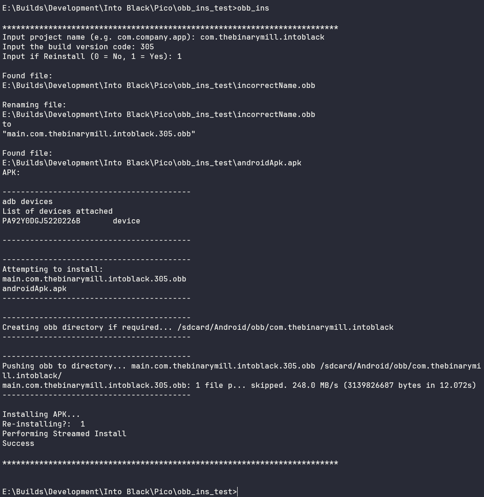
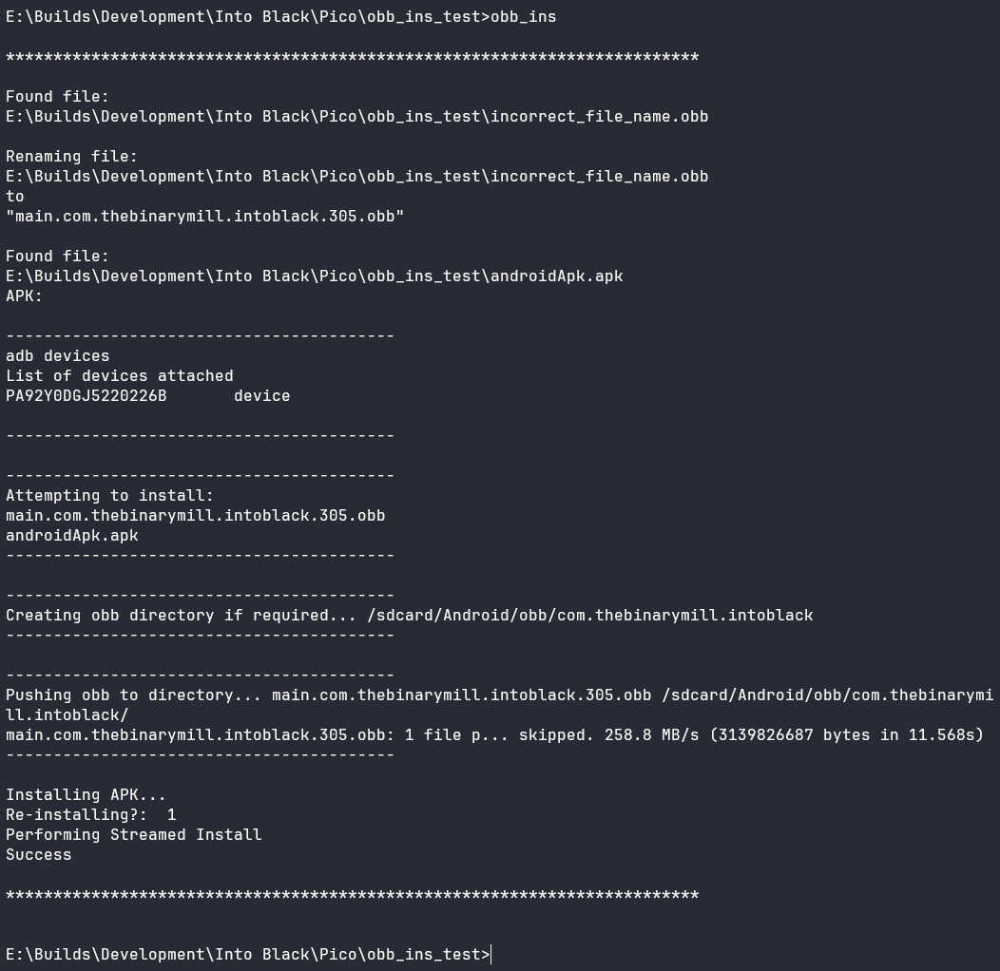

# APK & OBB Push Batch Script

A simple batch script that can be used to automate the installation of an APK and OBB.
Handles renaming of the OBB file if it's in the incorrect format (Unity builds).

## Getting Started


### Prerequisites

* ADB (See [Google ADB](https://developer.android.com/tools/adb))
* ADB added to PATH
* An APK & OBB

### Installation

```
$ Copy obb_ins.bat to build directory
```

## Usage

A few examples of useful commands and/or tasks.

```
$ Navigate to the directory containing the APK & OBB
$ Enter 'obb_ins' in the terminal
$ Input Project Name, Version Code and Reinstall preference
```

The project_name, version_code & reinstall varables can be prefilled in the script to avoid having to input on each install.

## Examples


**User Input:**



**Prefilled:**


